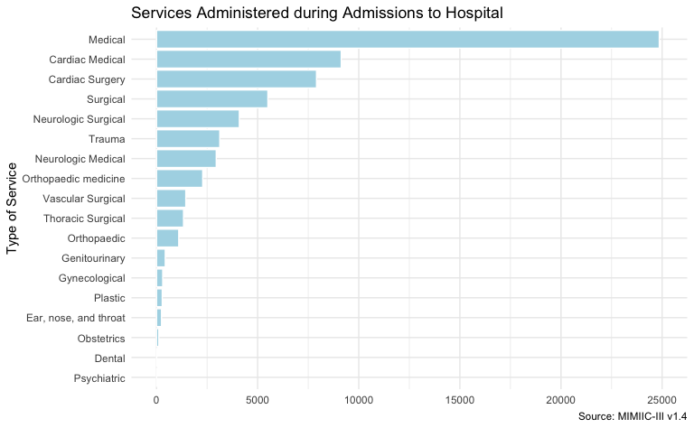

    


# {.tabset .tabset-fade}

## Data sets

This work references data on from the Medical Information Mart for Intensive Care MIMIC-III database v1.4. 
MIMIC-III is a large, freely-available database comprising de-identified health-related data from patients who
were admitted to the critical care units of the Beth Israel Deaconess Medical Center from 2001-2019.  Detailed
information can be obtained on the [MIMIC-III website](https://mimic.mit.edu/docs/iii/).

I have in *mimic_base_dir*/database/mimic3.db the SQLite version of the full MIMIC-III v1.4 database loaded. 
I'll use that in the processing below. The following code chunk attaches the database and loads auxiliary
functions (available in *mimic_base_dir*/mimic_concepts).


```r
base_dir <- here::here("")
db_file <- fs::path(base_dir, "database/mimic3.db")
if(dbCanConnect(RSQLite::SQLite(), db_file)) {
    mimic3 <- dbConnect(RSQLite::SQLite(), db_file)
} else {
    stop(str_c("Database file: ", db_file, " not found.", sep=""))
}

source(fs::path(base_dir, "mimic_concepts/mimic_concepts.R"))
```

The primary dataset used in the analysis is the full adult population (age >= 16) from the MIMIC-III database.
This data set includes patient demographics data, data about each admission for the patient, and data about any
ICU stays while the patient was admitted to the hospital.


```r
pat_icu <- mimic_get_patient_icustays(mimic3) %>% 
    filter(ADMISSION_AGE >= 16)
```


The `pat_icu` dataset contains information on 38,597 patients (23,144 men and 17,626 women), 49,785 individual hospital admissions, and 53,423 individual ICU stays.

Individual patients were admitted to the hospital between 1 and 41 times with the average number of admission being 1.3.  The average length of hospital stays was 10 days.

Per admission, patients were admitted to intensive care between 1 and 7 times with the average number of ICU stays per admission being 1.1.  The average length of an ICU stay was 4.1 days.

## Basic Patient Demographics {.tabset .tabset-fade .tabset-pills}

### Age


The average age of patients at the time of admission was 74.84 - for men the average was 69.83 and for women the average was 81.27.

Note:  Patients who are older than 89 years old at any time in the database have had their date of birth
shifted to obscure their age and comply with HIPAA.  These ages appear in the data as >= 300.  They do, however, show up in the correct `>= 90` decade bucket in the charts below.


```r
age_all <- pat_icu %>%
    filter(FIRST_ICUSTAY) %>% 
    select(SUBJECT_ID, HADM_ID, GENDER, ADMISSION_DECADE) %>% 
    ggplot(aes(x = ADMISSION_DECADE)) +
    geom_bar(
        fill = "light blue",
        color = "white",
        na.rm = TRUE) +
    labs(
        x = "Age Group", 
        y = NULL) +
    scale_y_continuous(limits = c(0, 12000), breaks = seq(0, 12000, by = 3000)) +
    theme_minimal()

age_m <- pat_icu %>%
    filter(FIRST_ICUSTAY, GENDER == 'M') %>% 
    select(SUBJECT_ID, HADM_ID, GENDER, ADMISSION_DECADE) %>% 
    ggplot(aes(x = ADMISSION_DECADE)) +
    geom_bar(
        fill = "light blue",
        color = "white",
        na.rm = TRUE) +
    labs(
        title = "Men",
        x = "Age Group", 
        y = NULL) +
    scale_y_continuous(limits = c(0, 7000), breaks = seq(0, 7000, by = 1000)) +
    theme_minimal() +
    theme(axis.text = element_text(size = 7))

age_f <- pat_icu %>%
    filter(FIRST_ICUSTAY, GENDER == 'F') %>% 
    select(SUBJECT_ID, HADM_ID, GENDER, ADMISSION_DECADE) %>% 
    ggplot(aes(x = ADMISSION_DECADE)) +
    geom_bar(
        fill = "light blue",
        color = "white",
        na.rm = TRUE) +
    labs(
        title = "Women",
        x = "Age Group", 
        y = NULL) +
    scale_y_continuous(limits = c(0, 7000), breaks = seq(0, 7000, by = 1000)) +
    theme_minimal() +
    theme(axis.text = element_text(size = 7))

age_all / ((age_m + age_f) + plot_layout(ncol = 2)) + 
    plot_annotation(
        title = "Population Age at Admission to Hospital",
        subtitle = "By Decade",
        caption = "Source: MIMIIC-III v1.4"
    )
```


### Ethnicity Group


By ethnicity group, white admissions accounted for the largest number (35,587) and highest percentage (71.5%) of admissions.


```r
pat_icu %>% 
    filter(FIRST_ICUSTAY) %>% # limit to one row of admission data which are repeated for multiple icu stays
    ggplot(aes(x = ETHNICITY_GROUP)) +
    geom_bar(
        fill = "light blue",
        color = "white",
        na.rm = TRUE) +
    labs(
        title = "Admission to Hospital by Ethnicity Group",
        caption = "Source: MIMIIC-III v1.4",
        y = NULL,
        x = "Ethnicity Group") +
    theme_minimal() +
    scale_y_continuous(limits = c(0, 40000), breaks = seq(0, 40000, by = 10000)) +
    scale_x_discrete(limits = as.character(ethnicity_n$ETHNICITY_GROUP))
```


### Admission Reason


Emergency admissions accounted for the largest number (41,447) and highest percentage (83.3%) of admissions.


```r
pat_icu %>% 
    filter(FIRST_ICUSTAY) %>% # limit to one row of admission data which are repeated for multiple icu stays
    ggplot(aes(x = ADMISSION_TYPE)) +
    geom_bar(
        fill = "light blue",
        color = "white",
        na.rm = TRUE) +
    labs(
        title = "Reason for Admission to Hospital",
        caption = "Source: MIMIIC-III v1.4",
        y = NULL,
        x = "Type of Admission") +
    theme_minimal() +
    scale_y_continuous(limits = c(0, 45000), breaks = seq(0, 45000, by = 15000)) +
    scale_x_discrete(limits = as.character(adm_type_n$ADMISSION_TYPE))
```


### Insurance Coverage


Medicare was the most prominent insurance coverage for hospital admissions (27,641) and highest percentage (55.5%).


```r
pat_icu %>% 
    filter(FIRST_ICUSTAY) %>% # limit to one row of admission data which are repeated for multiple icu stays
    ggplot(aes(x = INSURANCE)) +
    geom_bar(
        fill = "light blue",
        color = "white",
        na.rm = TRUE) +
    labs(
        title = "Insurance Coverage for Admissions to Hospital",
        caption = "Source: MIMIIC-III v1.4",
        y = NULL,
        x = "Type of Insurance") +
    theme_minimal() +
    scale_y_continuous(limits = c(0, 30000), breaks = seq(0, 30000, by = 10000)) +
    scale_x_discrete(limits = as.character(insurance_n$INSURANCE))
```


## Admission Activities {.tabset .tabset-fade .tabset-pills}

### Services


Here we look at the type of service patients received during hospital admissions.

Individual patients received between 1 and 9 services per admission
with the average number of services per admission being 1.3.

Medical (general service for internal medicine) was the
most common service provided during admissions (24,859) accounting for 38.2% of all services.


```r
pat_scvs %>% 
    ggplot(aes(y = SERVICE)) +
    geom_bar(
        fill = "light blue",
        color = "white",
        na.rm = TRUE) +
    labs(
        title = "Services Administered during Admissions to Hospital",
        caption = "Source: MIMIIC-III v1.4",
        y = "Type of Service",
        x = NULL) +
    theme_minimal() +
    scale_x_continuous(limits = c(0, 25000), breaks = seq(0, 25000, by = 5000)) +
    scale_y_discrete(limits = rev(as.character(services_n$SERVICE)))
```



```r

pat_scvs %>% 
    filter(FIRST_SERVICE) %>%
    ggplot(aes(y = SERVICE)) +
    geom_bar(
        fill = "light blue",
        color = "white",
        na.rm = TRUE) +
    labs(
        title = "Initial Services Provided at Admissions to Hospital",
        subtitle = "Probable Reason for Admission",
        caption = "Source: MIMIIC-III v1.4",
        y = "Type of Service",
        x = NULL) +
    theme_minimal() +
    scale_x_continuous(limits = c(0, 25000), breaks = seq(0, 25000, by = 5000)) +
    scale_y_discrete(limits = rev(as.character(first_services_n$SERVICE)))
```


